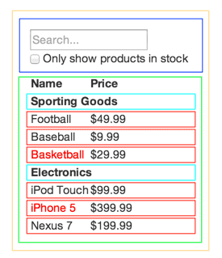

Skillsoft course, "Build Apps Using React: Introducing React for Web Applications"

Work can be found below:

<https://github.com/HenryFBP/introducing-react-work>

## Overview

React is a declarative, component based JS lib made by FB.

It uses an architectural design called "Virtual DOM" that makes it ideal for apps that work with fast-changing data.

It also uses a declarative extension to JS called JSX, making it easy to control component rendering.

- Virtual DOM
    - Helps React improve rendering by only updating changed components
- JSX
    - Render into HTML
- Babel compiler
    - JSX -> JS

After this course, you'll implement a simple webpage using React APIs.

## Introducing React

In 1990s-2000s, we used static HTML/CSS webpages. No real JS.

In 2000-2010, we started using JS to run clientside code to enhance webpages.

### What is React?

Using plain JS to make web apps is a PITA. Web apps aren't really maintainable with vanilla JS.

- React is a lib that helps web devs make interactive web apps.
- UI building in structured and maintainable way
- Used a LOT in Facebook, built for FB
- Open source project
- Instagram uses React too
- React is relatively new, public in May 2013
    - But very good for making component-based UI

React is NOT a framework.

React is a UI Library. It allows you to build components that are:

- Reusable
- Stateful
- Interactive

### MVC programming paradigm

UI interfaces generally follow the model-view-controller paradigm.

- Model
    - UIs have to work with data used to CRUD data.
    - What is used to represent the data. i.e. DB model, `Person` etc.
- View
    - What the user sees.
    - The data is visualized using the view.
- Controller
    - All of the complex bits that allow the View to work with the Model.

When you build UIs, you split up components to be part of the Model, View, or Controller.

React focuses entirely on the View. It does not interact with the data directly.

It is used to build component-based UIs.

Every UI is made of logical units - called "Components".

The whole idea behind using React is that these Components are reusable. Developed once and meant to be reused across multiple pages and applications.

Simple Components come together in React to make more complex Components.

"Component-driven Development".

## Thinking in React

Let's say we have a UI that looks like this:

```
Search: ________

[ ] Only show products in stock

Name        Price

  *Sporting Goods*
Football    $49.99
Baseball    $9.99
Basketball  $29.99

  *Electronics*
iPod Touch  $99.99
iPhone 5    $399.99
Nexus 7     $199.99
```

You can see we have two categories - electronics and sporting goods.

We can break this UI down into a component hierarchy.

<https://reactjs.org/docs/thinking-in-react.html>




1. FilterableProductTable (orange): contains the entirety of the example

The entire UI (orange) can be thought of as a top-level component. Lets's call it a `FilterableProductTable`. And it's the root of our component hierarchy.

2. SearchBar (blue): receives all user input

Next, the search bar and checkbox can be another component. It obviously sits inside the `FilterableProductTable` component.


3. ProductTable (green): displays and filters the data collection based on user input

The green table can be thought of as another nested component. This is the actual display of products available. Note that this product table can be further broken down into nested sub components.

For example, "Sporting Goods" and "Electronics" are their own categories and could be individual components, as category headers (4 and 5).

It is optional to you how granular you want to get when using the React JS library.

4. ProductCategoryRow (turquoise): displays a heading for each category
5. ProductRow (red): displays a row for each product

All of these components together build a component tree:

- FilterableProductTable
    - SearchBar
    - ProductTable
        - ProductCategoryRow
        - ProductRow

...

Components are considered "well designed" when when each component has a single responsibility.

This principle of "Single Responsibility" is a classic OOP design pattern. But is also important in component-driven dev't -- each component has 1 responsibility and is reusable.

React is NOT a framework, but a concept and a library built using that concept.

## React Features
## Exploting React Features
## The Virtual DOM
## Creating a Simple Static HTML page
## Exploring static HTML page
## Referencing prod React libs
## Nested Elements part 1
## Nested Elements part 2
## JSX
## Babel Compiler
## JSX + Babel
## More JSX
## Simple Expressions with JSX
## More Expressions with JSX
## Summary